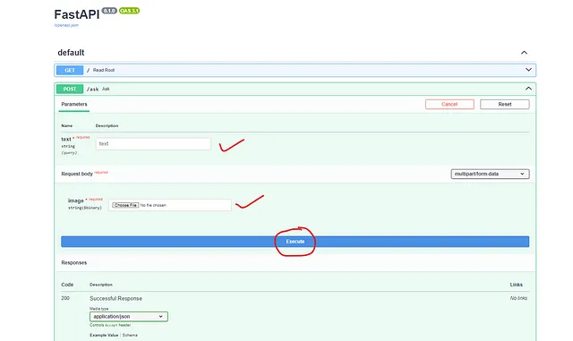

# Dockerize🐬your LLM🦣 FastAPI project📽️

**Topic covered:**

- *What is Fast API?*
- *Image to Text hugging Face LLM model*
- *End to end Project flow*

What is Fast API?
To find more details about Fast API use this project.

End-to-End Machine learning model🐍 deployment using FAST-API and HEROKU🏠
Here in this article, we will discuss end-to-end machine learning model deployment using the FAST-API python module and…
medium.com

If you go through Fast API docs, you will get to know that FastAPI is a modern, fast (high-performance), web framework for building APIs with Python 3.8+ based on standard Python.

Basic example:

```
from typing import Union

from fastapi import FastAPI

app = FastAPI()


@app.get("/")
def read_root():
    return {"Hello": "World"}


@app.get("/items/{item_id}")
def read_item(item_id: int, q: Union[str, None] = None):
    return {"item_id": item_id, "q": q}
```
To run the code:

```
uvicorn main:app --reload
```


## Image to Text hugging Face LLM model
We are going to use Vision-and-Language Transformer (ViLT) model fine-tuned on VQAv2 that is available on hugging face.

Model link : https://huggingface.co/dandelin/vilt-b32-finetuned-vqa


This is just an example, you can use any type of model you like and create an API interface with it by using Fast API.


## End to end Project flow


**NOTE**: You can create a virtual environment and pip install all the following modules.

```
fastapi
Pillow
python-multipart
torch
transformers
uvicorn
```

1. Create a `model.py` file, which will have a Vision-and-Language Transformer (ViLT) hugging face model.

```
from transformers import ViltProcessor, ViltForQuestionAnswering
from PIL import Image

# 470MB
processor = ViltProcessor.from_pretrained("dandelin/vilt-b32-finetuned-vqa")
model = ViltForQuestionAnswering.from_pretrained("dandelin/vilt-b32-finetuned-vqa")


def model_pipeline(text: str, image: Image):
    # prepare inputs
    encoding = processor(image, text, return_tensors="pt")

    # forward pass
    outputs = model(**encoding)
    logits = outputs.logits
    idx = logits.argmax(-1).item()

    return  model.config.id2label[idx]
```

2. Create a main.py file that will have fast API interface code to use the model in a swagger UI

```
from model import model_pipeline

from typing import Union

from fastapi import FastAPI, UploadFile
import io
from PIL import Image

app = FastAPI()


@app.get("/")
def read_root():
    return {"Hello": "World"}


@app.post("/ask")
def ask(text: str, image: UploadFile):
    content = image.file.read()
    
    image = Image.open(io.BytesIO(content))
    # image = Image.open(image.file)
    
    result = model_pipeline(text, image)
    return {"answer": result}
```


3. To test it locally, open the terminal and use :

```
uvicorn main:app --reload
```


Go to your local host and type /docs to get the UI swagger:

`http://localhost:8000/docs`



Write your question, upload the image, and click on execute to get the output (Find the example below).

**Question**: How many cats are there?

**Image**:


Fast API UI swagger output:


4. Everything seems to be working fine let’s dockerize it.

```
docker init
```

This will do the work:


As per recommendation use the following command to build the docker container.

```
docker compose up --build
```

After some time you will have your container created:


You can check the container in Docker desktop also and to run the fast API swagger go to http://localhost:8000/docs (Or click the link from Docker desktop).


For full code: https://github.com/Ravikumar10593-hub/docker-fastapi-ml/tree/main

### More about me:

I am a Data Science enthusiast🌺, Learning and exploring how Math, Business, and Technology can help us to make better decisions in the field of data science.

Want to read more: https://medium.com/@ravikumar10593/

YouTube Link (100k+ views): https://www.youtube.com/raviscontent

Find my all handles: https://linktr.ee/ravikumar10593